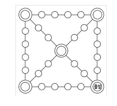

# 웇놀이 기능 명세서

## 1. 윷놀이 게임 기초세팅
- [ ] 참여자의 명수를 입력받는다
  - [ ] 참여자는 최소 2명에서 4명까지 가능하다
- [ ] 게임 말의 개수를 입력받는다
  - [ ] 게임 말은 최소 2개, 최대 5개까지 가능하다
- [ ] 윷놀이 판 커스터마이즈를 할 수 있다
  - [ ] 윷놀이 판의 최소 다각형은 사각형이다

## 2. 윷놀이 게임 진행

### 2-1. 윷 던지기
- [x] 윷을 던질 수 있다
  - [x] `랜덤 윷 던지기` : 랜덤한 윷의 결과가 나타난다.
  - [x] `지정 윷 던지기` : 빽도, 도, 개, 걸, 윷, 모 중 선택한 결과로 진행
- [ ] 윷이나 모가 나오면 한번 다시 던질 수 있다

### 2-2. 말 이동하기
- [ ] 이동할 말을 선택한다
- [ ] 말을 이동한다
  - 
  - [x] 원에서 출발할 떄 : 한 곳을 선택지로 제공한다
  - [x] 쌍원에서 출발할 때 : 두 곳을 선택지로 제공한다
  - [x] 출발 지점에서 빽도가 나왔을 때 : 도착으로 취급한다
  - [x] 정해진 이동 횟수 내에 도착지에 도착할 수 있을 때 : 도착으로 취급한다
- [ ] 이동한 곳에 상대방 말이 있다면 말을 잡을 수 있다
  - [ ] 상대 말을 잡으며 윷을 한번 더 던진다
- [ ] 이동한 곳에 자신의 말이 있다면 말을 업기를 선택할 수 있다 

## 3. 윷놀이 게임 종료
- [ ] 자신 팀의 모든 말을 내보는 팀이 승리한다
- [ ] 게임 종료 시, 승리 팀을 표시한다
- [ ] 재시작 혹은 종료를 선택할 수 있다

---

# 2. 유저 플로우(콘솔 기반)


```text

윷놀이 게임을 시작합니다.

# 윷 던지기
어떻게 윷을 던지시겠습니까?
1. 지정 윷 던지기
2. 랜덤 윷 던지기

지정 윷 던지기 선택 시 - 어떤 결과를 원하시나요?
도, 개, 걸, 윷, 모, 빽도

[윷 결과] 가 나왔습니다.

#말 이동하기

어떤 말을 이동하시겠습니까? (ex. 4개의 말로 플레이 중)
1- [위치]
2- [위치]
3,4- [위치] <- 말을 업은 경우

어디로 이동하시겠습니까?

ex1) 일반 원에서 이동중 일 경우
1 - [이동 위치]

ex2) 쌍원에서 이동중 일 경우
1 - [이동 위치]
2 - [이동 위치]


#말 이동 특수룰

- 우리팀 말 업기
[위치]에 나의 말이 있습니다. 말을 업으시겠습니까? (Yes / No)

- 상대팀 말 잡기
[위치]에 상대 팀의 말을 잡았습니다.

# 게임 종료
윷놀이 게임이 종료되었습니다. 플레이어[번호]가 승리하셨습니다!

윷놀이 게임을 다시 시작할까요?
1. 재시작
2. 종료
```

