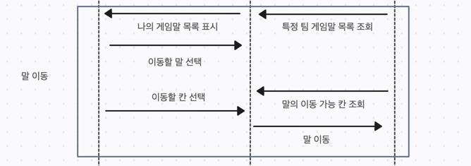

# 시퀀스 다이어그램
```text
최종 수정일 : (25.3.27)  
작성자 : 김건우
```

# 1. 게임 시작


1. 유저로부터 게임 필수 정보를 입력받는다
2. 윷놀이 세팅을 요청한다
3. 세팅 완료 정보를 응답한다 


# 2. 윷놀이 게임

게임의 턴은 `윷 던지기 > 말 이동 > 말 업기(선택) > 말 잡기(선택)`의 순서를 반복한다 


## 2-1 윷 던지기


1. 윷 던지기 전략(랜덤 or 지정)을 선택한다
2. 윷 던지기를 요청한다
3. 윷 결과를 반환한다

## 2-2. 말 이동


1. 턴을 진행하고 있는 팀의 말 목록을 조회한다
2. 유저는 이동할 말을 선택한다
3. 이동 가능한 칸을 조회한다  
4. 말 이동 요청을 보낸다  
   4-1. 이동가능한 칸이 1개인 경우 : 그 칸으로 이동한다  
   4-2. 이동가능한 칸이 2개 이상인 경우 : 이동할 칸을 유저가 선택한다

## 2-3. 말 업기


1. 이동한 칸에서 업힐 수 있는 말(나의 팀 말) 목록을 조회한다
2. 업힐 수 있는 말이 있을 경우, 유저는 업히기를 선택한다.  
   2-1. 업힐 경우 : 업힐 말을 선택하여 요청을 보낸다

## 2-4. 말 잡기

1. 이동한 칸에서 잡을 수 있는 말(상대 팀 말) 목록을 조회한다  
2. 잡을 수 있는 말이 있을 경우, 무조건 잡는다  
   2-1. 잡을 수 있는 말이 1개일 경우 : 그 말을 잡는다  
   2-2. 잡을 수 있는 말이 여러개일 경우 : 말을 선택하여 잡는다  
3. 말을 잡았을 경우, 같은 팀은 윷놀이 게임의 턴을 1회 더 반복한다.

# 3. 게임 종료

1. 각 턴의 마지막에 게임이 끝난는지 확인한다
2. 게임이 끝났을 경우, 승리 플레이어 번호를 보여준다
3. 게임의 재시작/취소 선택 여부를 물어본다
